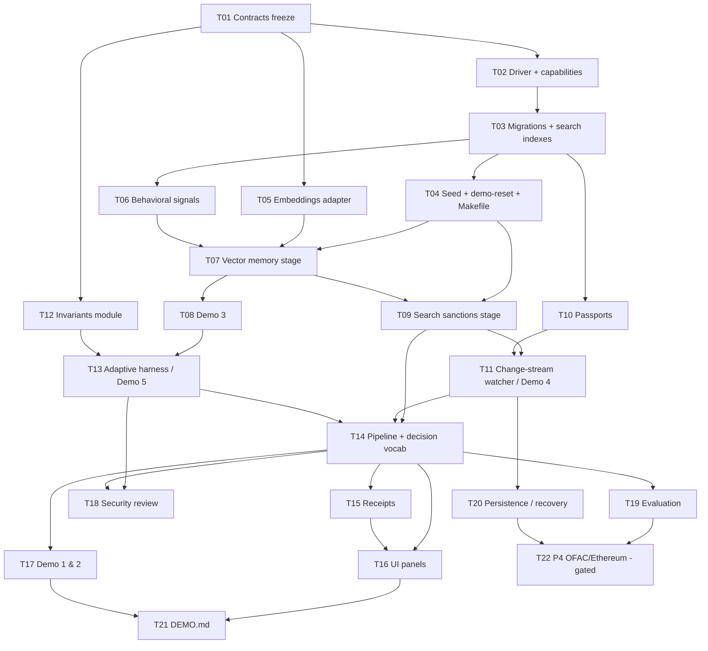

# KYAgent — Delivery Plan (MongoDB "Recursive Harnessing")

Companion to `MONGODB_HACKATHON_GAP_ANALYSIS.md`. Repo `/tmp/ky` @ `7a5177b`. Baseline: 131/131 tests green on `MemoryStore`.
Owner rule: **preserve the working foundation, do not rewrite.** Every task below extends existing files or adds new modules alongside them.

---

## 1. Objective and definition of done

**Objective:** turn KYAgent from a store-agnostic identity service into an agent-risk investigation harness where **MongoDB Atlas is the mechanism**. That means Atlas operational state, Atlas Search for sanctions, Vector Search over verified security memory, Change Streams for continuous re-screening, and a versioned adaptive harness bounded by immutable invariants.

**P0 (all DEMO-BLOCKING):**
1. **P0-1 Atlas operational state.** All domain collections are in Atlas. `npm run demo` / `make demo` uses `MongoStore` and refuses to start without `MONGODB_URI`. No in-memory substitution.
2. **P0-2 MongoDB Search sanctions stage.** Exact wallet match gives a deterministic BLOCK. Fuzzy/alias `$search` produces evidence. Called from the pipeline and recorded in the receipt.
3. **P0-3 Vector Search verified memory (Demo 3).** A seeded VERIFIED takeover `INV-1042` is retrieved for a similar-but-not-identical case. It is shown in the evidence and receipt, survives restart, and an irrelevant memory is not used.
4. **P0-4 Change Streams continuous KYA (Demo 4).** A sanctions update is detected, TreasuryBot is found, re-screened and investigated, and its passport goes `ACTIVE → RE_SCREENING → SUSPENDED`, visible live in the UI.
5. **P0-5 Adaptive harness (Demo 5).** Immutable invariants module plus versioned adaptive policy. A human confirms `CONFIRMED_ACCOUNT_TAKEOVER`, memory is promoted to VERIFIED, and harness v2 is persisted with old/new/evidence/timestamp/approval. The next case shows the extra step.

**Status gates:**
- `CORE_MVP_COMPLETE` ⇔ P0-1..P0-5 acceptance tests pass on Atlas (`npm run test:atlas`) **and** the existing 131 tests still pass (`npm test`).
- `DEMO_READY` ⇔ `CORE_MVP_COMPLETE` ∧ `make demo-reset && make demo` runs Demos 3, 4 and 5 end-to-end against Atlas with visible UI panels ∧ `docs/DEMO.md` exists.

---

## 2. Priority ladder (BINDING)

| Rank | Item |
|---|---|
| P0 | Mongo-native loop (Atlas state + Search + Vector Search + Change Streams wired into one investigation pipeline) |
| P0 | Immutable invariants / adaptive harness separation |
| P0 | Demo 3: verified security memory via Vector Search changes the decision |
| P0 | Demo 4: sanctions change stream → re-screen → passport SUSPENDED |
| P0 | Demo 5: human-confirmed takeover → memory VERIFIED → harness v2 → next case differs |
| P1 | Demo 1: clean ALLOW |
| P1 | Demo 2: BLOCK over delegation max |
| P1 | Compliance receipts + evidence |
| P2 | Evaluation harness |
| P2 | Cross-session persistence / crash recovery (resume tokens) |
| P3 | Polished frontend |
| P4 | Real OFAC feed / real Ethereum reads |
| P5 | Everything else |

---

## 3. Hard scope gates (machine-checkable)

Status file: `harness/gates.json` (written by `npm run gates`, which runs the named acceptance tests and records PASS/FAIL).

```
IF gates.vector_memory      != PASS THEN prohibit tasks tagged [blockchain]
IF gates.change_stream      != PASS THEN prohibit tasks tagged [new-integration]
IF gates.harness_adaptation != PASS THEN prohibit tasks tagged [stretch]
IF gates.p0_demos           != PASS THEN prohibit tasks tagged [polish]
```

Gate → test mapping:
- `vector_memory` = `test/atlas/memory.vector.test.js`
- `change_stream` = `test/atlas/sanctions.watch.test.js`
- `harness_adaptation` = `test/atlas/harness.adapt.test.js`
- `p0_demos` = all of `test/atlas/*.test.js` + `node scripts/demo.js --check`

**Non-goals (explicit):** real OFAC/SDN ingestion (P4, fixture only), real Ethereum RPC or on-chain settlement (P4), real KYC provider, multi-tenant UI redesign, LLM-authored decisions (the LLM may only *propose* adaptive-policy diffs), renaming existing entities (`operators`/`grants`/`credentials` stay and get aliased), replacing the hash-chained audit log, key rotation UI, rate-limit redistribution, React/SPA frameworks.

---

## 4. New minimum vertical slice (as a test)

`test/atlas/vertical-slice.test.js` (skipped unless `ATLAS_TEST_URI` is set):

```js
test('vertical slice: agent action -> Atlas -> Search -> signals -> Vector memory -> invariants+harness -> decision -> receipt -> persisted; then sanctions change -> watcher -> re-eval -> passport SUSPENDED', async () => {
  const w = await atlasWorld();                   // make demo-reset equivalent on a unique db name
  // 1. action
  const r = await w.investigate('TreasuryBot', { action: 'payments:create', asset: 'USDC', amount: 24_000,
                                                 to: '0xNEWCOUNTERPARTY…', signingKey: w.rotatedKey });
  // 2..5 stages present, in order, each with evidence
  assert.deepEqual(r.stages.map(s => s.name),
    ['identity','delegation','sanctions','signals','memory','policy','decision']);
  assert.equal(r.stages[2].engine, '$search');
  assert.ok(r.signals.includes('SIGNING_KEY_CHANGED') && r.signals.includes('NEW_COUNTERPARTY'));
  assert.equal(r.memory.engine, '$vectorSearch');
  assert.equal(r.memory.hits[0].memoryId, 'mem_INV-1042'); assert.equal(r.memory.hits[0].status, 'VERIFIED');
  assert.equal(r.riskDecision, 'REVIEW');          // precedent escalates; invariants did not block
  // 6..7 receipt + persistence
  const inv = await w.db.collection('investigations').findOne({ _id: r.investigationId });
  assert.equal(inv.receipt.harnessVersion, 1); assert.ok(inv.receipt.sanctionsDatasetVersion);
  assert.ok(await w.auditHas('receipt.issued', r.investigationId));
  // data change -> change stream -> re-eval -> trust state
  await w.applySanctionsUpdate('2026-09-26');      // adds TreasuryBot's counterparty wallet
  const p = await w.waitForPassport('TreasuryBot', 'SUSPENDED', { timeoutMs: 15000 });
  assert.deepEqual(p.statusHistory.map(h => h.status), ['ACTIVE','RE_SCREENING','SUSPENDED']);
});
```

---

## 5. Demo-first data

Loaded by `scripts/demo-seed.js` (new), which calls `seedHackathon(db)` in `src/seed/hackathon.js`. The existing `src/seed.js#seedDemo` stays for `deploy.test.js:87`. All documents carry `demo: true` so reset can target them. IDs are fixed strings for reproducibility.

| # | Collection | Document sketch |
|---|---|---|
| 1 | `operators` (principal) | `{_id:'op_NORTHWIND', type:'organization', legalName:'Northwind Treasury Ltd', country:'GB', status:'verified', verification:{method:'fixture', kycResult:'pass', sanctionsResult:'clear'}}` |
| 2 | `businesses` | `{_id:'biz_CIRCLEPAY', name:'CirclePay Merchant (demo)'}` |
| 3 | `agents` | `{_id:'agt_TREASURYBOT', name:'TreasuryBot', operatorId:'op_NORTHWIND', publicKey, keyThumbprint, status:'active', wallets:[{chain:'evm', address:'0x7a3f…c001'}], signingKeyHistory:[{thumbprint, from}]}` |
| 4 | `grants` (delegation) | `{_id:'grt_TB_USDC', agentId, businessId, operatorId, actions:['payments:create'], constraints:{maxAmount:25000_000000, currency:'USDC'}, permittedTools:['usdc.transfer'], asset:'USDC', approvedWallet:'0x7a3f…c001', maxTxAmount:25000_000000, dailyLimit:100000_000000, validFrom, expiresAt:+30d, status:'active', version:1}` |
| 5 | `transactions` ×30 | `{_id, agentId, wallet:'0x7a3f…c001', asset:'USDC', amount: 800–4200 USDC (median ≈ 2000), counterparty:{address:'0xKNOWN_A…'/'0xKNOWN_B…', name}, signingKeyThumbprint:<original>, at: last 30 days}` |
| 6 | `security_memories` VERIFIED | `{_id:'mem_INV-1042', title:'Treasury agent account takeover', status:'VERIFIED', outcome:'CONFIRMED_ACCOUNT_TAKEOVER', signals:['SIGNING_KEY_CHANGED','NEW_COUNTERPARTY','AMOUNT_ANOMALY','NEAR_CEILING'], signalsText:'…', embedding:[…1024], embeddingModel:'voyage-3.5-lite', verifiedBy:'usr_analyst_1', verifiedAt, sourceInvestigationId:'INV-1042', recommendedSteps:['signing_key_history_check']}` |
| 7 | `security_memories` irrelevant | `{_id:'mem_INV-0977', title:'Rate-limit misconfiguration on reporting bot', status:'VERIFIED', outcome:'FALSE_POSITIVE', signals:['VELOCITY'], …}` |
| 8 | `security_memories` UNVERIFIED | `{_id:'mem_INV-1101', status:'UNVERIFIED', …similar to 1042}`, used to prove `INV_UNVERIFIED_MEMORY_NOT_PRECEDENT` |
| 9 | `sanctions` baseline ×~50 | `{_id:'sdn_…', name, aliases:[…], type:'entity'/'individual', programs:['CYBER2'], wallets:[{chain:'evm', address}], datasetVersion:'2026-09-01'}` (include a "Lazarus Group"-style entry with aliases for the fuzzy demo) |
| 10 | `sanctions_updates` (staged, not applied) | `{_id:'upd_2026-09-26', datasetVersion:'2026-09-26', upserts:[{_id:'sdn_NEW', name:'Garantex Proxy Ops', aliases:['Garantex Prx'], wallets:[{address:'0xKNOWN_B…'}]}]}`: sanctions TreasuryBot's existing counterparty |
| 11 | `passports` | `{_id:'pp_TREASURYBOT', agentId, principalId:'op_NORTHWIND', delegationId:'grt_TB_USDC', delegationVersion:1, wallet, status:'ACTIVE', harnessVersion:1, sanctionsDatasetVersion:'2026-09-01', statusHistory:[{status:'ACTIVE', at}]}` |
| 12 | `harness_versions` | `{_id:1, version:1, status:'active', invariantsHash:<INVARIANTS_HASH>, policy:{steps:['identity','delegation','sanctions','signals','memory','policy'], memoryRetrieval:{k:3, minScore:0.78, filter:{status:'VERIFIED'}}, escalation:[{if:'precedent.outcome==CONFIRMED_ACCOUNT_TAKEOVER', then:'REVIEW'}], evidenceRequests:[]}, createdAt, approvedBy:'seed'}` |

**Contract:**
- `make demo-reset`: requires `MONGODB_URI`. It drops the `demo:true` docs and the collections `investigations, harness_events, watcher_state, passports, receipts`, re-runs migrations and `ensureSearchIndexes()` (polling `listSearchIndexes` until `queryable`), re-seeds items 1–12, restores `harness_versions` to v1 only, and exits 0 only when both search indexes are queryable. It is idempotent.
- `make demo`: requires `MONGODB_URI` (hard fail, no MemoryStore). It starts the API plus the sanctions watcher, prints the dashboard URL and demo keys, and exposes `POST /v1/demo/:n/run` (dev only) so each demo can be triggered from the UI. `make demo CHECK=1` runs Demos 1–5 headless and exits non-zero on any mismatch.
- `package.json` adds `"demo": "node scripts/demo.js"` (rewritten to use MongoStore), `"demo:reset": "node scripts/demo-reset.js"`, `"test:atlas": "node --test test/atlas/"`, `"eval": "node eval/run.js"` and `"gates": "node scripts/gates.js"`. The Makefile wraps them.

---

## 6. Task DAG

Legend: kind / role / priority / tags / deps / size.

**T01: Architecture delta + contracts freeze**
- Kind ARCHITECTURE · MongoDB Specialist + Security Engineer · P0 · tags [core] · deps none · size M
- Files: new `docs/contracts/investigation-pipeline.md`, `docs/contracts/mongo-collections.md`, `docs/contracts/search-indexes.json`, `docs/contracts/receipt.schema.json`, `docs/contracts/harness.md`, `docs/contracts/decision-vocabulary.md`, `docs/contracts/passport.md`; extend `docs/contracts/openapi.yaml`, `types.ts`, `ARCHITECTURE.md` (§9 "Investigation harness").
- Acceptance: the JSON index definitions validate (`sanctions_search`: dynamic false, `name`/`aliases` as `string` with `lucene.standard` plus a `phonetic` custom analyzer, `wallets.address` as `token`; `memory_vector`: `{type:'vector', path:'embedding', numDimensions:1024, similarity:'cosine'}` + `{type:'filter', path:'status'}`). New endpoints are listed in openapi. `RISK_REASON_CODES` are defined. `npm test` stays at 131/131.
- Validation: `npm test && node -e "JSON.parse(require('fs').readFileSync('docs/contracts/search-indexes.json'))"`

**T02: Mongo driver + Atlas capability plumbing**
- Kind IMPLEMENT · MongoDB Specialist · P0 · tags [core] · deps T01 · size S
- Files: `package.json` (`"dependencies":{"mongodb":"^6.10"}` + lockfile), `Dockerfile` (`npm ci --omit=dev`), `src/store/mongo.js` (expose `this.db`, `capabilities.{atlasSearch, changeStreams}` detected via `hello.setName` + a `listSearchIndexes` probe), `src/store/memory.js` (new repos as CRUD doubles; `search/vector/watch` throw `AtlasRequiredError`), `src/config.js` (`SANCTIONS_MODE|CHAIN_MODE|LLM_MODE|EMBEDDINGS_MODE ∈ live|fixture`; replace the "ignored" warnings at l.154–155).
- Acceptance: `npm ls mongodb` resolves. `config.test.js` is updated for the new modes. The 131 tests pass.
- Validation: `npm ci && npm test`

**T03: Migrations 004–008 + ensureSearchIndexes**
- Kind IMPLEMENT · MongoDB Specialist · P0 · tags [core] · deps T02 · size M
- Files: `src/store/migrations.js` (append `004_principals_view_delegation_fields`, `005_transactions`, `006_sanctions` incl. `{ 'wallets.address':1 }`, `007_investigations_passports_receipts`, `008_security_memories_harness` incl. `$jsonSchema` validators for `harness_versions` that forbid an `invariants` key); new `src/store/searchIndexes.js` (`ensureSearchIndexes(db, defs)` using `createSearchIndex` + a queryable poll).
- Acceptance: `deploy.test.js` migration tests still pass on `fakeDb`. `test/atlas/indexes.test.js` shows both indexes `queryable` in < 120 s.
- Validation: `npm test && ATLAS_TEST_URI=… node --test test/atlas/indexes.test.js`

**T04: Demo seed + demo-reset + Makefile (FIRST deliverable)**
- Kind DEMO · Demo Engineer · P0 · tags [core, demo] · deps T03 · size M
- Files: new `src/seed/hackathon.js`, `scripts/demo-seed.js`, `scripts/demo-reset.js`, `Makefile`, `fixtures/sanctions/baseline-2026-09-01.json`, `fixtures/sanctions/update-2026-09-26.json`, `fixtures/memories/*.json` (with precomputed fixture embeddings), `fixtures/transactions/treasurybot.json`; rewrite `scripts/demo.js:9,26` to `MongoStore` with a hard fail on a missing URI.
- Acceptance: `make demo-reset` twice gives identical document counts. `make demo` without `MONGODB_URI` exits 1 with the message "Atlas required". A `grep -n MemoryStore scripts/demo*.js` gives 0 hits.
- Validation: `make demo-reset && mongosh "$MONGODB_URI" --eval 'db.security_memories.countDocuments({status:"VERIFIED"})'`

**T05: Embeddings adapter**
- Kind IMPLEMENT · Backend Engineer · P0 · tags [core] · deps T01 · size S
- Files: new `src/memory/embeddings.js` (`embed(text)`: Voyage `voyage-3.5-lite` when `EMBEDDINGS_MODE=live`, otherwise a fixture lookup by `sha256(signalsText)` from `fixtures/embeddings.json`; asserts the dimension equals the index `numDimensions`), `src/memory/signalsText.js` (deterministic text from signals via `canonicalJson`).
- Acceptance: the fixture and live vectors for the seed memories have the same dimension. An unknown text in fixture mode throws (no silent zero vector).
- Validation: `node --test test/memory.embeddings.test.js`

**T06: Behavioral signals stage**
- Kind IMPLEMENT · Backend Engineer · P0 · tags [core] · deps T03 · size M
- Files: new `src/investigation/signals.js` (aggregation on `transactions`: `$group` with `$percentile` p50/p95, a velocity window, a first-seen counterparty and wallet, `SIGNING_KEY_CHANGED` vs `agents.signingKeyHistory`, `NEAR_CEILING` ≥ 0.9 × `maxTxAmount` or the daily remaining amount).
- Acceptance: a unit test on the memory double using a JS fallback, and an Atlas test on the seed history. A 24 000 USDC payment to a new counterparty with a rotated key yields exactly `{NEW_COUNTERPARTY, SIGNING_KEY_CHANGED, AMOUNT_ANOMALY, NEAR_CEILING}`.
- Validation: `node --test test/investigation.signals.test.js`

**T07: Vector Search memory stage (Demo 3 shortest path)**
- Kind IMPLEMENT · MongoDB Specialist · P0 · tags [core] · deps T04, T05, T06 · size M
- Files: new `src/memory/retrieve.js` (`$vectorSearch` `{index:'memory_vector', path:'embedding', queryVector, numCandidates:100, limit:k, filter:{status:'VERIFIED'}}` + `$project` score via `$meta:'vectorSearchScore'`, drop < `minScore`), `src/investigation/pipeline.js` (skeleton: identity → delegation → signals → memory → decision).
- Acceptance: `test/atlas/memory.vector.test.js` passes.
  - A similar case (different amount and counterparty, same signal pattern) returns `mem_INV-1042` at rank 1.
  - An irrelevant query (`VELOCITY` only) does **not** return 1042 above `minScore`.
  - `mem_INV-1101` (UNVERIFIED) is never returned.
  - After closing and re-opening the client (a new process), the same result is returned (persistence).
- Validation: `ATLAS_TEST_URI=… node --test test/atlas/memory.vector.test.js`

**T08: Demo 3 end-to-end**
- Kind DEMO · Demo Engineer · P0 · tags [core, demo] · deps T07 · size S
- Files: `scripts/demo.js` (`--demo 3`), `src/app.js` (`POST /v1/investigations`, admin/business), `src/services/investigations.js` (new).
- Acceptance: `riskDecision:'REVIEW'` with reason `MEMORY_PRECEDENT_TAKEOVER`; the investigation doc persists `memory.hits`.
- Validation: `make demo CHECK=1 DEMO=3`

**T09: MongoDB Search sanctions stage**
- Kind IMPLEMENT · MongoDB Specialist · P0 · tags [core] · deps T04, T07 · size M
- Files: new `src/sanctions/screen.js`:
  1. An exact `find({'wallets.address': {$in:[agentWallet, counterparty]}})`, which triggers `INV_SANCTIONS_EXACT_BLOCK`.
  2. `$search` `compound.should` over `text {query:name, path:['name','aliases'], fuzzy:{maxEdits:2}}` + `text` on the phonetic multi-analyzer, with `$meta:'searchScore'`, returning top 5 with `datasetVersion`.

  `src/services/kyc.js` keeps the regex only for `SANCTIONS_MODE=fixture` operator onboarding (`api.test.js` stays green).
- Acceptance: `test/atlas/sanctions.search.test.js`.
  - An exact sanctioned wallet gives BLOCK deterministically (10/10 runs).
  - "Lazarus Grp" / "Lazarous Group" return the entity in the top 3.
  - A clean counterparty gives no hit.
  - The stage output lands in `investigation.stages[sanctions].evidence`.
- Validation: `ATLAS_TEST_URI=… node --test test/atlas/sanctions.search.test.js`

**T10: Passport model + transitions**
- Kind IMPLEMENT · Security Engineer · P0 · tags [core] · deps T03 · size M
- Files: new `src/services/passports.js` (`transition(id, from[], to, reason, actor)` via `updateIf`, pushing to `statusHistory`; the system actor is required), `src/services/credentials.js` (add `kya_passport`, `kya_harness_v`, `kya_delegation_v` claims), `src/services/trust.js` (a `sanctions_exposure` factor reads the passport), `src/services/audit.js` (`passport.*` types).
- Acceptance:
  - Only legal transitions succeed.
  - An agent- or operator-role principal cannot transition its own passport (403).
  - `audit.test.js` 'event types are a closed set' is updated and green.
- Validation: `npm test`

**T11: Change-stream sanctions watcher (Demo 4)**
- Kind IMPLEMENT · MongoDB Specialist · P0 · tags [core] · deps T09, T10 · size M
- Files: new `src/watchers/sanctionsWatcher.js` (`watch` on `sanctions` with `fullDocument:'updateLookup'`; resume token in `watcher_state`; affected agents by `agents.wallets.address` ∪ `transactions.counterparty.address`; passport → `RE_SCREENING`, run the pipeline with `trigger:'sanctions_change'`, → `SUSPENDED` on a hit), `scripts/apply-sanctions-update.js`, `src/server.js` (start the watcher when `capabilities.changeStreams`), `src/app.js` (`GET /v1/events/stream` SSE, admin).
- Acceptance: `test/atlas/sanctions.watch.test.js`.
  - Applying `upd_2026-09-26` makes the TreasuryBot passport history `[ACTIVE, RE_SCREENING, SUSPENDED]` within 15 s.
  - The investigation exists with `trigger:'sanctions_change'`.
  - Killing the watcher mid-way and restarting resumes from the token without missing the event.
- Validation: `ATLAS_TEST_URI=… node --test test/atlas/sanctions.watch.test.js`

**T12: Immutable invariants module**
- Kind IMPLEMENT · Security Engineer · P0 · tags [core] · deps T01 · size M
- Files: new `src/harness/invariants.js` (a frozen array: `INV_SANCTIONS_EXACT_BLOCK`, `INV_DELEGATION_MAX` wrapping `authz.constraintsSatisfied`, `INV_DAILY_LIMIT`, `INV_NO_SELF_APPROVAL`, `INV_NO_SELF_PASSPORT_MODIFICATION`, `INV_UNVERIFIED_MEMORY_NOT_PRECEDENT`; exports `INVARIANTS_HASH = sha256(source)`); refactor `verification.js` `evaluate()` so the l.113–127 constraint checks call the invariant (behaviour identical).
- Acceptance:
  - A new `test/harness.invariants.test.js` covers each invariant, positive and negative.
  - `Object.isFrozen` holds.
  - A policy document containing `invariants` or `skipInvariants` is rejected by `validatePolicy()`.
  - All 34 verify/unit tests are unchanged and green.
- Validation: `npm test`

**T13: Adaptive harness + adaptation event (Demo 5)**
- Kind IMPLEMENT · Backend Engineer + Security Engineer · P0 · tags [core] · deps T08, T12 · size L
- Files:
  - new `src/harness/policy.js` (load the active `harness_versions`, `validatePolicy`)
  - `src/harness/adaptation.js` (`proposeFromOutcome(investigation, memory)`: in `LLM_MODE=fixture` a deterministic template adds step `signing_key_history_check` after `signals` and sets `memoryRetrieval.k=5`; in `live` the LLM returns a JSON diff that is schema-validated and cannot touch invariants)
  - `src/services/investigations.js` (`confirm(id, outcome, approver)`: approver ≠ agent/operator of the case (`INV_NO_SELF_APPROVAL`); memory `UNVERIFIED → VERIFIED` with embedding; `harness_versions` v2 insert + `harness_events` `{from:1, to:2, diff, evidence:[invId, memId], approvedBy, at}`; v1 → `status:'superseded'`)
  - `src/app.js` (`POST /v1/investigations/:id/confirm`, `GET /v1/harness/versions`)
- Acceptance: `test/atlas/harness.adapt.test.js`.
  - Before confirm, case B runs 6 stages with `harnessVersion:1`.
  - Confirm case A as `CONFIRMED_ACCOUNT_TAKEOVER`, approved by an admin.
  - `harness_versions` has v2 with a diff.
  - Case B′ (equivalent) runs 7 stages including `signing_key_history_check`, receipt `harnessVersion:2`, and a different context size.
  - `INVARIANTS_HASH` is identical in v1 and v2.
  - A self-approval attempt gives 403.
- Validation: `ATLAS_TEST_URI=… node --test test/atlas/harness.adapt.test.js`

**T14: Full pipeline assembly + decision vocabulary**
- Kind INTEGRATE · Backend Engineer · P0 · tags [core] · deps T09, T11, T13 · size M
- Files: `src/investigation/pipeline.js` (final order identity → delegation → sanctions → signals → memory → [adaptive steps] → policy → decision), `src/contracts.js` (`RISK_DECISIONS = ['ALLOW','REVIEW','BLOCK']`, `RISK_REASON_CODES`), `docs/contracts/types.ts` + `openapi.yaml` (new `RiskDecision`, leaving `Decision` untouched), `src/sdk/businessVerifier.js` (l.146: tolerate a `riskDecision` field), `test/contracts.test.js` (new sync test for the risk codes).
- Acceptance: `test/atlas/vertical-slice.test.js` (§4) passes. `/v1/verify` responses are byte-compatible with before. The 131 legacy tests pass.
- Validation: `npm test && npm run test:atlas`

**T15: Compliance receipts**
- Kind IMPLEMENT · Security Engineer · P1 · tags [core] · deps T14 · size M
- Files: new `src/services/receipts.js` (build per `receipt.schema.json`: decision, agent, principal, timestamp, identity/delegation/sanctions results, signals, retrieved memory ids + scores + status, `sanctionsDatasetVersion`, `policyVersion` (= `TRUST_RULES_VERSION` + invariants hash), `harnessVersion`, `delegationVersion`, `traceId` = `requestId`, evidence[]; `receiptHash = sha256(canonicalJson(receipt))`; `audit.record('receipt.issued', …, {receiptHash})`), `GET /v1/investigations/:id/receipt`.
- Acceptance: the receipt validates against the schema. Tampering with a stored receipt makes `receiptHash` mismatch, and `verifyChain()` stays valid.
- Validation: `node --test test/receipts.test.js`

**T16: UI evidence panels + live continuous-KYA strip**
- Kind IMPLEMENT · Frontend Engineer · P1 · tags [core, ui] · deps T14, T15 · size M
- Files: `dashboard/app.js` (new "Investigations" view: 4 panels `Current signals` / `MongoDB security memory (Vector Search)` with score and VERIFIED badge / `Harness v{n}` with the added step highlighted / `Decision + receipt`; a "Continuous KYA" strip subscribed to `/v1/events/stream`: Change detected → Affected agent → Re-screen → SUSPENDED), `dashboard/index.html`, `dashboard/styles.css`.
- Acceptance: `dashboard.test.js` 'no innerHTML, only contract endpoints' stays green. A new test asserts the view renders the 4 panel headings from a fixture investigation JSON.
- Validation: `npm test`

**T17: Demo 1 & 2 wiring**
- Kind DEMO · Demo Engineer · P1 · tags [demo] · deps T14 · size S
- Files: `scripts/demo.js` (`--demo 1|2`; TreasuryBot 1 500 USDC to a known counterparty ⇒ ALLOW; 30 000 USDC ⇒ BLOCK `DELEGATION_MAX_EXCEEDED`, which wraps the existing `CONSTRAINT_VIOLATION`, `verify.test.js:127`).
- Acceptance: `make demo CHECK=1 DEMO=1` / `DEMO=2` exits 0 and the receipts exist.
- Validation: `make demo CHECK=1`

**T18: Security review of the invariant boundary**
- Kind REVIEW · Reviewer + Security Engineer · P0 · tags [core] · deps T13, T14 · size S
- Files: read-only review of `src/harness/*`, `src/services/investigations.js`, `src/watchers/*`.
- Acceptance: a written checklist. No policy path can bypass invariants; the LLM output is schema-validated; the watcher runs with a least-privilege DB user (readWrite on the app db only); `MONGODB_URI` is never logged.
- Validation: `npm test && npm run test:atlas`

**T19: Evaluation harness**
- Kind EVALUATE · Evaluation Engineer · P2 · tags [eval] · deps T14 · size M
- Files: new `eval/golden/*.json` (≥ 12 cases: clean, over-max, exact sanction, fuzzy sanction, takeover-similar, irrelevant-only, unverified-only), `eval/run.js` (writes `eval/results/<timestamp>.json`).
- Acceptance: all six metrics (§9) are computed from actual runs, and there are no literal metric numbers in the source.
- Validation: `npm run eval`

**T20: Cross-session persistence / crash recovery**
- Kind TEST · MongoDB Specialist · P2 · tags [core] · deps T11 · size S
- Files: `test/atlas/persistence.test.js` (spawns `node src/server.js`, kills it, restarts; memory retrieval, harness v2 and passport state all persist; the watcher resume token replays a missed update).
- Acceptance: green on Atlas.
- Validation: `npm run test:atlas`

**T21: docs/DEMO.md + judge script**
- Kind DOCUMENT · Demo Engineer · P1 · tags [docs] · deps T16, T17 · size S
- Files: new `docs/DEMO.md` (prereqs: Atlas cluster tier, `.env` keys, `make demo-reset`, a 5-demo walkthrough with expected screens, fallback modes); README link. `docs.test.js` 'relative links resolve' must stay green.
- Acceptance: a fresh clone plus an Atlas URI reproduces all demos by following the doc.
- Validation: `npm test`

**T22 (P4, gated): Real OFAC SDN import / Ethereum RPC reads**
- Kind IMPLEMENT · Backend Engineer · P4 · tags [blockchain, new-integration] · deps T19, T20 · size L
- Blocked by gates until `vector_memory` and `change_stream` are PASS.



Critical path: T01 → T02 → T03 → T04 → T07 → T08 → T13 → T14 → T15 → T16 → T21.
Parallel lanes after T03: {T05, T06} → T07; T10; T12.

---

## 7. Contracts to freeze before parallel work (T01 outputs in `docs/contracts/`)

1. `mongo-collections.md`: every collection (existing + `principals` view, `transactions`, `sanctions`, `sanctions_updates`, `investigations`, `security_memories`, `passports`, `receipts`, `harness_versions`, `harness_events`, `watcher_state`), with fields, indexes, validators, the owner service and the alias mapping operator→principal, grant→delegation.
2. `search-indexes.json`: exact `createSearchIndex` definitions for `sanctions_search` and `memory_vector` (plus the optional third), with the analyzer definitions.
3. `investigation-pipeline.md`: the stage list, the input/output shape per stage (`{name, engine, startedAt, durationMs, result, evidence[]}`), failure semantics (any stage error ⇒ BLOCK/INTERNAL, fail closed as in `verification.js:176–206`), trigger types (`api`, `sanctions_change`, `manual`).
4. `decision-vocabulary.md`: `Decision (ALLOW|DENY)` is unchanged on `/v1/verify`; `RiskDecision (ALLOW|REVIEW|BLOCK)`; the mapping table; `RISK_REASON_CODES`.
5. `receipt.schema.json`: a JSON Schema for the compliance receipt (fields listed in T15).
6. `harness.md`: the invariants list (id, rule, source line) with `INVARIANTS_HASH`; the adaptive policy JSON schema; the `harness_events` shape; the adaptation approval rules.
7. `passport.md`: fields, the state machine `ACTIVE ⇄ REVIEW → SUSPENDED → REVOKED`, `ACTIVE → RE_SCREENING → {ACTIVE|SUSPENDED}`, allowed actors per transition, and the credential claim additions.
8. `environment.md` (update): `MONGODB_URI` required for the demo, `ATLAS_TEST_URI`, `VOYAGE_API_KEY`, `SANCTIONS_MODE|CHAIN_MODE|LLM_MODE|EMBEDDINGS_MODE = live|fixture`.
9. `openapi.yaml` + `types.ts` (update): `POST /v1/investigations`, `GET /v1/investigations/:id`, `GET /v1/investigations/:id/receipt`, `POST /v1/investigations/:id/confirm`, `GET /v1/passports/:agentId`, `GET /v1/harness/versions`, `GET /v1/events/stream`, and dev-only `POST /v1/demo/:n/run`.

---

## 8. Fixture strategy per external dependency

| Dependency | live | fixture (default for demo safety) | Never |
|---|---|---|---|
| Embeddings | Voyage `voyage-3.5-lite` 1024-d via `VOYAGE_API_KEY`, or Atlas automated embeddings if available on the cluster | `fixtures/embeddings.json`: vectors precomputed **once with the live model** for every seed memory and golden query, keyed by `sha256(signalsText)`; an unknown key throws | random or zero vectors; a different model than the index dimension |
| Atlas Search / Vector Search | Atlas cluster (M0 OK: 2 of 3 index slots used) or `mongodb/mongodb-atlas-local` Docker for offline dev | none: there is **no in-memory emulation** of `$search`/`$vectorSearch`; unit tests use `AtlasRequiredError` doubles and acceptance runs on Atlas | substituting MemoryStore in `make demo` |
| Chain (EVM / USDC) | P4: read-only RPC for wallet history | `fixtures/transactions/treasurybot.json` loaded into `transactions` in Atlas (`CHAIN_MODE=fixture`) | on-chain writes |
| Sanctions feed | P4: OFAC SDN XML → `sanctions` upsert (which also fires the change stream) | `fixtures/sanctions/baseline-2026-09-01.json` + `update-2026-09-26.json` applied by `scripts/apply-sanctions-update.js`: a real Mongo write, so the change stream fires genuinely | the regex `kyc.js:10` as a wallet screen |
| LLM (adaptation proposer) | a model returns a JSON policy diff that is schema-validated | a deterministic template in `src/harness/adaptation.js` | the LLM deciding ALLOW/BLOCK or touching invariants |

---

## 9. Evaluation plan (metrics and measurement; no numbers pre-filled)

All metrics are produced by `npm run eval` against Atlas and written to `eval/results/*.json`. Any number in slides must come from that file.

1. **Recall@3 (memory):** for each golden case labelled with its relevant memory id(s), run the memory stage. The metric is the fraction of cases where a relevant VERIFIED memory appears in the top 3 `$vectorSearch` hits.
2. **Relevant vs irrelevant retrieval separation:** for each case, record the score of the relevant memory versus the best irrelevant one (`mem_INV-0977`). Report the per-case margin and the count of cases where irrelevant ≥ `minScore` (a false precedent). UNVERIFIED memories must appear 0 times (assert).
3. **Golden-case decision correctness:** the fraction of golden cases whose `riskDecision` equals the label, plus a confusion matrix over ALLOW/REVIEW/BLOCK. Exact sanctioned-wallet cases must be BLOCK in 100 % of repeated runs (determinism check, N repeats).
4. **Cross-session persistence:** run case X, record the memory hits and harness version, terminate the process, start a new process with a new client, and re-run X. Pass if the hit ids, order and harness version are identical.
5. **Change-stream re-screen success:** apply N sanctions updates, each affecting a known set of agents. Measure the fraction of affected agents whose passport reached SUSPENDED, the false suspensions of unaffected agents, and the latency from write to SUSPENDED (p50/p95 of observed values), including the kill/resume variant.
6. **Harness v1 vs v2 behaviour:** run the same golden subset under v1 and v2 and report the step lists, the context size (memories k and evidence items), and the decisions per case. The diff must match the `harness_events` diff, and the invariant outcomes must be identical across versions (assert).

---

## 10. What to tell the judges

> KYAgent is an investigation harness for AI agents that move money. Every decision is assembled inside MongoDB Atlas: Atlas Search screens wallets and counterparties against sanctions, Vector Search pulls in only *human-verified* security memories as precedent, and Change Streams re-screen agents the moment a sanctions list changes. When an analyst confirms an account takeover, the harness rewrites its own investigation policy into a new, versioned, auditable harness version stored in MongoDB. The next case visibly runs the extra step, while a frozen set of invariants (exact-sanctions block, delegation limits, no self-approval, no unverified precedent) stays out of reach of the model and the adaptation loop.
