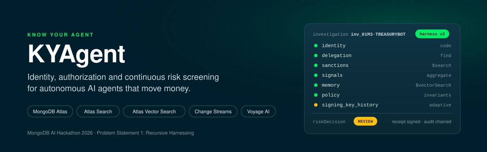
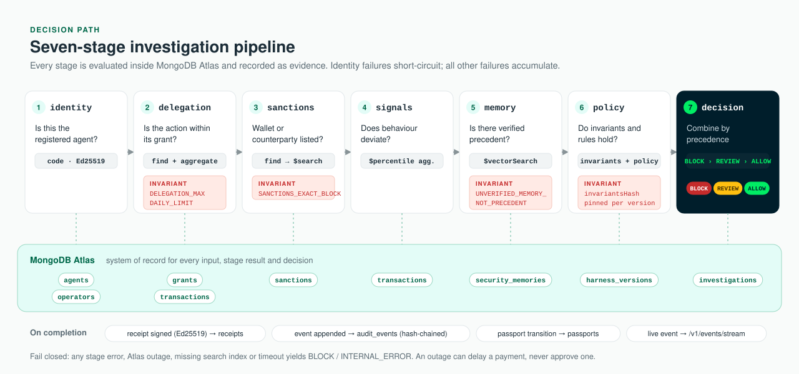
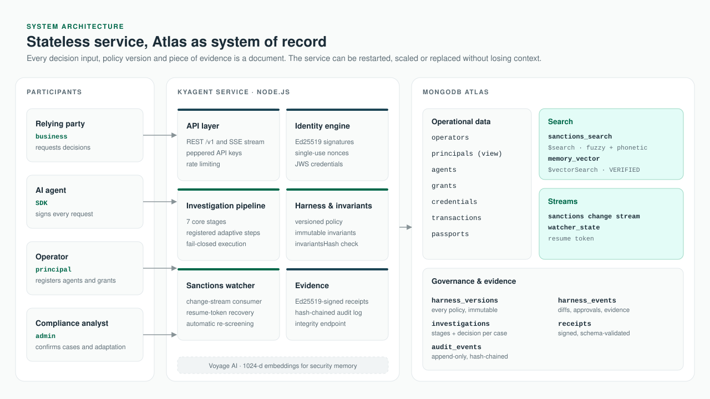
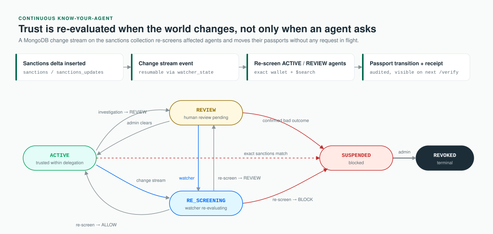
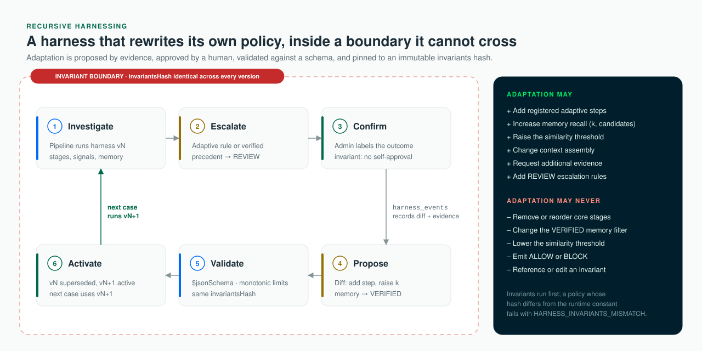

<p align="center">
  
</p>

<p align="center">
  
  
  
  
  
  <a href="https://kyagent-live.vercel.app"></a>
</p>

<p align="center">
  <a href="#executive-summary">Summary</a> ·
  <a href="#how-a-decision-is-made">Decision path</a> ·
  <a href="#architecture">Architecture</a> ·
  <a href="#mongodb-atlas-capability-map">Atlas capabilities</a> ·
  <a href="#adaptive-governance-recursive-harnessing">Recursive harnessing</a> ·
  <a href="#security-model">Security</a> ·
  <a href="#getting-started">Getting started</a>
</p>

<p align="center"><b>Live demo:</b> <a href="https://kyagent-live.vercel.app">KYAgent Live Console</a> — screen any wallet or counterparty against the current OFAC SDN list.</p>

---

## Executive summary

Enterprises are beginning to delegate payments, procurement and treasury operations to autonomous AI agents. The controls around them were designed for people and static API clients: KYC happens once at onboarding, API keys prove possession rather than identity, and nothing re-checks an agent when its behaviour or the regulatory picture changes.

**KYAgent is Know-Your-Agent infrastructure.** Before an agent acts, a relying party asks KYAgent whether it should proceed. KYAgent verifies the agent's cryptographic identity, confirms the action falls inside a delegated mandate, screens the wallet and counterparty against sanctions, compares behaviour to the agent's own history, recalls human-verified precedent, and returns an explainable decision — `ALLOW`, `REVIEW` or `BLOCK` — with a signed receipt and a tamper-evident audit record.

Two properties distinguish it from a rules engine. It is **continuous**: a MongoDB change stream re-screens agents the moment a sanctions list changes, with no request in flight. And it is **self-improving within fixed limits**: when an analyst confirms an attack, the harness writes a new, versioned investigation policy for the next case, while a hash-pinned set of invariants remains permanently outside the reach of both the model and the adaptation loop.

<table>
<tr>
<td width="25%" valign="top"><b>Verify</b><br><sub>Ed25519 agent identity, single-use nonces, operator accountability, scoped JWS credentials.</sub></td>
<td width="25%" valign="top"><b>Authorize</b><br><sub>Delegations with per-transaction and rolling 24-hour limits, approved wallets, assets and expiry.</sub></td>
<td width="25%" valign="top"><b>Screen continuously</b><br><sub>Exact and fuzzy sanctions screening, behavioural signals, and change-stream re-screening.</sub></td>
<td width="25%" valign="top"><b>Adapt safely</b><br><sub>Human-approved, schema-validated policy versions bounded by immutable invariants.</sub></td>
</tr>
</table>

| At a glance | |
|---|---|
| **Built for** | MongoDB AI Hackathon 2026 — Problem Statement 1: *Recursive Harnessing* |
| **Data & memory layer** | MongoDB Atlas: documents, Atlas Search, Atlas Vector Search, Change Streams |
| **Embeddings** | Voyage AI, 1024 dimensions (deterministic fixture vectors for offline runs) |
| **Runtime** | Node.js ≥ 20, zero-framework HTTP service, static dashboard |
| **Delivery state** | Core MVP complete — all P0 and P1 requirements passing against Atlas |

---

## The problem

Consider **Northwind**, whose agent **TreasuryBot** settles supplier invoices in USDC under a delegation of up to 10,000 USDC per transaction. On any given day, the following can happen — and each requires a different, defensible response:

| Event | KYAgent decision | Basis |
|---|---|---|
| A look-alike agent presents TreasuryBot's name with a forged signature | **BLOCK** · `IDENTITY_DENIED` | Signature fails; the pipeline short-circuits |
| TreasuryBot requests 30,000 USDC | **BLOCK** · `DELEGATION_MAX_EXCEEDED` | Invariant `INV_DELEGATION_MAX` |
| TreasuryBot pays a wallet on the sanctions list | **BLOCK** · `SANCTIONS_EXACT_MATCH`, passport → `SUSPENDED` | Invariant `INV_SANCTIONS_EXACT_BLOCK` |
| The signing key changes and a new counterparty appears | **REVIEW** with `SIGNING_KEY_CHANGED`, `NEW_COUNTERPARTY` | Behavioural signals and verified precedent |
| An overnight list update names an existing counterparty | Passport `ACTIVE → RE_SCREENING → SUSPENDED` | Change-stream re-screen, no request required |

Conventional controls address at most the first row. None of them produce an audit trail that a compliance function can query for *which policy version* made a decision and *which evidence* it relied on.

---

## How a decision is made

<p align="center"></p>

Each request passes through a fixed sequence of stages. Every stage writes a structured result — its inputs, the MongoDB operation that produced it, and any reasons it contributed — to the case's `investigations` document.

| # | Stage | Question answered | MongoDB operation | Collections |
|:-:|---|---|---|---|
| 1 | `identity` | Is this the registered agent, acting for an active operator? | Signature and nonce verification | `agents`, `operators` |
| 2 | `delegation` | Is the action, amount, asset and wallet within the mandate? | `find` + rolling 24 h `aggregate` | `grants`, `transactions` |
| 3 | `sanctions` | Is the wallet or counterparty listed — exactly or approximately? | `find` on B-tree index, then `$search` | `sanctions` |
| 4 | `signals` | Does this action deviate from the agent's history? | `aggregate` with `$percentile` (p50/p95), velocity, first-seen | `transactions` |
| 5 | `memory` | Has a human verified a similar case before? | `$vectorSearch`, filtered to `VERIFIED` | `security_memories` |
| 6 | `policy` | Do all invariants hold? Which escalation rules fire? | Invariant evaluation against active harness version | `harness_versions` |
| 7 | `decision` | What is the combined outcome? | Precedence `BLOCK › REVIEW › ALLOW` | `investigations` |

**Two decision vocabularies.** The identity layer (`POST /v1/verify`) answers `ALLOW` or `DENY` with a stable reason code and is byte-compatible with existing integrations. The investigation layer (`POST /v1/investigations`) answers `ALLOW`, `REVIEW` or `BLOCK`. Precedence is strict: adaptive rules and memory precedent can only raise a case to `REVIEW`; only invariants, identity failures and passport state can `BLOCK`; nothing can downgrade a `BLOCK`.

**Fail-closed by construction.** A stage exception, an Atlas error, a missing or non-queryable search index, an embedding failure or a timeout produces `BLOCK` with reason `INTERNAL_ERROR`. An outage can delay a payment; it cannot approve one.

---

## Architecture

<p align="center"></p>

The service is stateless. Operational data, search indexes, the change-stream resume position, every harness version and every piece of decision evidence live in MongoDB Atlas. The service can be restarted mid-stream and resume from the stored token; any past decision can be reconstructed from documents alone.

<details>
<summary><b>Data model</b> — collections and their role</summary>

| Collection | Purpose | Notable fields / indexes |
|---|---|---|
| `operators` · `principals` | Accountable owners of agents | `principals` is a read-only view over `operators` |
| `agents` | Registered agents | public key, `signingKeyHistory[]`, `wallets[]` (indexed on `wallets.address`) |
| `grants` | Delegations | `maxTxAmount`, `dailyLimit`, `approvedWallet`, `asset`, `validFrom`, `version` |
| `credentials` | Scoped, expiring, key-bound JWS credentials | revocable; checked on every verification |
| `passports` | Current trust state per agent | `ACTIVE` · `REVIEW` · `RE_SCREENING` · `SUSPENDED` · `REVOKED` |
| `transactions` | Settlement history | feeds velocity, percentile and daily-limit calculations |
| `sanctions` · `sanctions_updates` | Listed entities, aliases, wallets; staged deltas | Atlas Search index `sanctions_search`; B-tree on `wallets.address` |
| `security_memories` | Embedded past investigations | Vector Search index `memory_vector`; `status` (`VERIFIED` / `UNVERIFIED`) |
| `investigations` | One document per case | ordered `stages[]`, signals, decision, `harnessVersion` |
| `harness_versions` | Every investigation policy ever active | immutable; `policy` validated by `$jsonSchema`; `invariantsHash` |
| `harness_events` | Adaptation history | diff, old/new policy, evidence, approver |
| `receipts` | Signed compliance receipts | Ed25519-signed; schema in `docs/contracts/receipt.schema.json` |
| `audit_events` | Append-only, hash-chained log | integrity verifiable via `GET /v1/audit-events/integrity` |
| `watcher_state` | Change-stream resume token | resumes without missing events after a restart |

</details>

---

## MongoDB Atlas capability map

KYAgent uses Atlas as more than storage: four platform capabilities each carry a distinct part of the decision.

| Capability | Role in KYAgent | Why it matters |
|---|---|---|
| **Atlas Search** | Fuzzy and phonetic screening of names and aliases (`sanctions_search`) | Sanctions evasion relies on transliteration and look-alike spelling; lexical-only matching misses it |
| **Atlas Vector Search** | Retrieval of human-verified precedent (`memory_vector`, 1024-d, cosine) | Institutional memory informs new cases without letting unverified material influence outcomes |
| **Change Streams** | Real-time re-screening when sanctions data changes | Converts a point-in-time check into a standing control |
| **Document model + aggregation** | Delegations, behavioural statistics, versioned policy, evidence and audit | Every decision is reconstructable with a query, not a log search |

<details>
<summary><b>Atlas Search</b> — exact match as an invariant, fuzzy match as evidence</summary>

<br>

Screening runs in two steps with deliberately different consequences. An exact wallet match uses a conventional B-tree index and is an invariant (`BLOCK`). A fuzzy or phonetic name match uses Atlas Search and contributes `REVIEW`-grade evidence.

```js
// 1 · Deterministic — never dependent on $search
db.sanctions.find({ "wallets.address": { $in: [wallet, counterparty] } });

// 2 · Approximate — standard + phonetic analyzers on name and aliases
db.sanctions.aggregate([
  { $search: {
      index: "sanctions_search",
      compound: { should: [
        { text: { query: name, path: ["name", "aliases"], fuzzy: { maxEdits: 2 } } },
        { text: { query: name, path: [{ value: "name", multi: "phonetic" },
                                      { value: "aliases", multi: "phonetic" }] } }
      ] }
  } },
  { $limit: 5 },
  { $project: { name: 1, programs: 1, score: { $meta: "searchScore" } } }
]);
```
</details>

<details>
<summary><b>Atlas Vector Search + Voyage AI</b> — precedent, never proof</summary>

<br>

Closed investigations are embedded with Voyage AI (1024 dimensions) and stored in `security_memories`. Retrieval is restricted to memories an administrator has verified; the restriction is enforced twice — in the `$vectorSearch` filter and again on every returned hit — and is itself an invariant (`INV_UNVERIFIED_MEMORY_NOT_PRECEDENT`). Hits below the policy's similarity threshold are discarded before context assembly.

```js
db.security_memories.aggregate([
  { $vectorSearch: {
      index: "memory_vector",
      path: "embedding",
      queryVector: embed(signalsText(signals)),   // Voyage AI, 1024-d
      numCandidates: 100,
      limit: k,                                    // set by the active harness version
      filter: { status: "VERIFIED" }
  } },
  { $project: { title: 1, outcome: 1, score: { $meta: "vectorSearchScore" } } }
]);
```

In the reference scenario, three memories exist: `INV-1042` (verified, relevant), `INV-0977` (verified, irrelevant) and `INV-1101` (unverified). Only `INV-1042` reaches the decision, and the case is escalated to `REVIEW` with that precedent attached.
</details>

<details>
<summary><b>Change Streams</b> — continuous Know-Your-Agent</summary>

<br>

The sanctions watcher consumes a change stream on the `sanctions` collection and persists its resume token in `watcher_state`. Each insert triggers a re-screen of every `ACTIVE` and `REVIEW` agent; the affected passports transition, receipts and audit events are written, and the next verification observes the new state.

```js
const stream = db.sanctions.watch(
  [{ $match: { operationType: "insert" } }],
  { resumeAfter: await loadResumeToken() }
);
for await (const change of stream) {
  await rescreenAffectedAgents(change.fullDocument);
  await saveResumeToken(change._id);
}
```

Change streams are available on every Atlas tier, including M0.
</details>

<p align="center"></p>

---

## Adaptive governance (recursive harnessing)

<p align="center"></p>

The hackathon brief asks for a harness that evolves its own rules, context policies and guardrails. The engineering challenge is doing so without creating a system that can talk itself out of its own controls. KYAgent separates the two concerns explicitly.

**Immutable invariants** are defined in code (`src/harness/invariants.js`), evaluated before any adaptive rule, and fingerprinted by `INVARIANTS_HASH`. Every harness version records the hash it was created under; if the active version's hash does not match the runtime constant, the policy stage blocks with `HARNESS_INVARIANTS_MISMATCH`.

| Invariant | Enforces |
|---|---|
| `INV_SANCTIONS_EXACT_BLOCK` | An exact sanctioned wallet or counterparty is always blocked |
| `INV_DELEGATION_MAX` | Amount never exceeds the delegation's per-transaction maximum |
| `INV_DAILY_LIMIT` | Rolling 24-hour spend never exceeds the delegation's daily limit |
| `INV_NO_SELF_APPROVAL` | An agent's principal or relying party cannot confirm its own case or verify its own memory |
| `INV_NO_SELF_PASSPORT_MODIFICATION` | Only the system or an administrator may transition a passport |
| `INV_UNVERIFIED_MEMORY_NOT_PRECEDENT` | Unverified memory can never enter context or trigger escalation |

**The adaptive policy** — stage composition, retrieval parameters, context assembly, evidence requests and escalation rules — is stored in `harness_versions` and validated by a `$jsonSchema` on every write. It changes only through `POST /v1/investigations/{id}/confirm`, called by an administrator. Adaptation is monotonic: it may add stages, evidence and `REVIEW` escalations, or tighten retrieval, but it may never remove core stages, relax the verified-memory filter, lower the similarity threshold, emit `ALLOW` or `BLOCK`, or reference an invariant.

**Reference walkthrough (Demo 5).**

1. Case A — an unexpected key change and new counterparty — is escalated to `REVIEW` under harness **v1** (7 stages, memory `k = 3`).
2. A business-role key attempts to confirm the case and receives `403 FORBIDDEN` (`INV_NO_SELF_APPROVAL`). No state changes.
3. An administrator confirms `CONFIRMED_ACCOUNT_TAKEOVER` with adaptation approved. Case A's memory is promoted to `VERIFIED`.
4. Harness **v2** is written with the diff `add /steps/5 signing_key_history_check` and memory `k = 5`. v1 is marked `superseded`; both versions share the same `invariantsHash`. A `harness_events` record captures the diff, both policies, the evidence and the approver.
5. Case B′, equivalent to case A, now executes **eight** stages under `harnessVersion: 2` and returns `REVIEW` with reason `MEMORY_PRECEDENT_TAKEOVER`, citing the newly verified memory. The receipt records the version that decided it.

---

## Security model

| Threat | Control | Outcome |
|---|---|---|
| Agent impersonation | Ed25519 signature bound to the registered key thumbprint | `DENY` / `BLOCK IDENTITY_DENIED` |
| Request replay | Single-use nonces within a bounded time window | `DENY NONCE_REPLAYED` |
| Scope or limit abuse | Delegation checks; `INV_DELEGATION_MAX`, `INV_DAILY_LIMIT` | `BLOCK` |
| Sanctioned counterparty | Exact wallet match on a B-tree index; `INV_SANCTIONS_EXACT_BLOCK` | `BLOCK`, passport `SUSPENDED` |
| Name obfuscation | Atlas Search fuzzy + phonetic matching | `REVIEW` with scored evidence |
| Account takeover | Key-change, new-wallet, velocity and anomaly signals; verified precedent | `REVIEW`, then adapted policy |
| Memory poisoning | `VERIFIED`-only retrieval, enforced twice; invariant | Unverified hits dropped and recorded |
| Collusive approval | `INV_NO_SELF_APPROVAL`, `INV_NO_SELF_PASSPORT_MODIFICATION` | `403 FORBIDDEN` |
| Policy tampering | `$jsonSchema` on `harness_versions.policy`; `invariantsHash` check | `BLOCK HARNESS_INVARIANTS_MISMATCH` |
| Audit tampering | Hash-chained `audit_events`; integrity endpoint | Break detected and reported |
| Credential exposure | API keys stored as HMAC-SHA-256 hashes with a server-side pepper; constant-time comparison | Keys unrecoverable from the database |
| Dependency outage | Fail-closed pipeline | `BLOCK INTERNAL_ERROR` |

A review of the invariant boundary is documented in [`docs/SECURITY_REVIEW_HARNESS.md`](docs/SECURITY_REVIEW_HARNESS.md).

---

## Getting started

**Live demo:** [KYAgent Live Console](https://kyagent-live.vercel.app) — screen any wallet or counterparty against the current OFAC SDN list.

### Prerequisites

| Requirement | Notes |
|---|---|
| Node.js ≥ 20 | `npm install` fetches the official `mongodb` driver |
| MongoDB Atlas cluster | M0 (free tier) is sufficient; two of its three search-index slots are used |
| Network access | Your IP on the Atlas access list |
| External services | None required — Voyage AI, sanctions and chain data run in fixture mode by default |

### Local evaluation (no database)

```bash
git clone https://github.com/pauloes-btechs/KYAgent && cd KYAgent
npm install
npm run demo
```

Runs the identity layer end to end in memory — operator and business onboarding, agent registration, delegation, credential issuance, allowed / over-limit / out-of-scope / replayed / tampered requests, and revocation — then prints the dashboard URL and demo-only API keys.

### Full deployment on Atlas

```bash
npm run env:init                       # generates signing key, API-key pepper, bootstrap admin key
# .env: MONGODB_URI='mongodb+srv://…'   MONGODB_DB=kyagent
set -a; . ./.env; set +a

make demo-reset                        # migrations, reference scenario, search indexes (≈ 10 s)
make demo                              # API + dashboard on Atlas
```

### Reference scenarios

| # | Scenario | Expected outcome | Command |
|:-:|---|---|---|
| 1 | Known counterparty, 1,500 USDC | `ALLOW`, passport `ACTIVE`, receipt persisted | `make demo CHECK=1 DEMO=1` |
| 2 | 30,000 USDC against a 10,000 USDC delegation | `BLOCK DELEGATION_MAX_EXCEEDED` | `make demo CHECK=1 DEMO=2` |
| 3 | Case resembling a verified past investigation | `REVIEW` with precedent; unverified and irrelevant memories excluded | `make demo CHECK=1 DEMO=3` |
| 4 | Sanctions update applied while agents are idle | Affected passport `ACTIVE → RE_SCREENING → SUSPENDED` | `npm start`, then `npm run sanctions:apply` |
| 5 | Confirmed account takeover | Harness v1 → v2; next equivalent case runs an additional stage and returns `REVIEW` / `MEMORY_PRECEDENT_TAKEOVER` | see [`docs/DEMO.md`](docs/DEMO.md) |

The complete runbook, including expected output for every step, is in [`docs/DEMO.md`](docs/DEMO.md).

---

## API surface

| Endpoint | Purpose |
|---|---|
| `POST /v1/verify` | Identity-layer decision (`ALLOW` / `DENY`) for a signed agent request |
| `POST /v1/investigations` | Full pipeline decision (`ALLOW` / `REVIEW` / `BLOCK`) with evidence |
| `POST /v1/investigations/{id}/confirm` | Analyst confirmation; optional human-approved adaptation |
| `GET  /v1/investigations/{id}/receipt` | Signed compliance receipt |
| `GET  /v1/passports/{id}` · `/transitions` | Current trust state and history |
| `GET  /v1/harness/versions` · `/events` | Policy versions and adaptation history |
| `GET  /v1/audit-events/integrity` | Verifies the audit hash chain |
| `GET  /v1/events/stream` | Server-sent events for live dashboards |
| `/v1/operators` · `/agents` · `/grants` · `/credentials` · `/api-keys` | Lifecycle management |

The full contract is in [`docs/contracts/openapi.yaml`](docs/contracts/openapi.yaml). Integration guides for [operators](docs/guides/operator-integration.md) and [relying parties](docs/guides/business-integration.md) are in `docs/guides/`.

---

## Repository layout

```
src/
  crypto/           Ed25519, canonical JSON, credentials, API-key hashing
  services/         agents, grants, credentials, passports, verification, audit
  investigation/    pipeline, signals, adaptive steps
  harness/          invariants, policy validation, adaptation
  sanctions/        exact + Atlas Search screening, change-stream watcher
  memory/           embeddings adapter (Voyage / fixture), vector retrieval
  store/            MongoDB store, migrations, search-index management
  sdk/              agent signer and business verifier SDKs
dashboard/          static operations dashboard
docs/contracts/     frozen API, schema, index and decision-vocabulary contracts
docs/guides/        integration guides
scripts/            demo, seed, reset, sanctions update, key generation
test/               unit and contract suites; test/atlas/ integration suites
```

---

## Quality and verification

| Area | Coverage |
|---|---|
| Unit and contract tests | 28 suites, including invariants, decision vocabulary, crypto, contracts-vs-docs synchronisation |
| Atlas integration tests | 9 suites against a live cluster: index readiness, sanctions search, change-stream watcher, vector memory, signals, harness adaptation, vertical slice, reference demos |
| Reproducibility | Deterministic fixture modes for sanctions, chain, LLM and embeddings; demo reset is idempotent |
| Requirement traceability | Each requirement in [`DELIVERY_PLAN.md`](DELIVERY_PLAN.md) maps to tasks, tests and a coverage status |

---

## Delivery status

| Requirement group | Status |
|---|---|
| P0 — Identity and delegation, Atlas Search screening, Vector Search memory, Change Streams, adaptive harness | **Passing** |
| P1 — Pipeline assembly, compliance receipts, UI evidence panels, reference demos, security review | **Passing** |
| P2 — Evaluation harness, crash-recovery test | Deferred |
| P4 — Live OFAC SDN import, on-chain reads | Deferred (gated) |

All data in this repository is synthetic. No real sanctions list, customer, wallet or transaction is included.

---

## Engineering approach

KYAgent was delivered by **Foundry**, an autonomous software-delivery system: a written brief is compiled into a requirement set and task graph; coding agents implement each task in an isolated git worktree; an independent reviewer must approve every change before it merges; validation — including the Atlas integration suites — runs deterministically after each task; rejected work re-enters as a repair task carrying the reviewer's findings. The initial gap analysis that re-prioritised the build around MongoDB capabilities is in [`MONGODB_HACKATHON_GAP_ANALYSIS.md`](MONGODB_HACKATHON_GAP_ANALYSIS.md).

---

## Documentation

| Document | Contents |
|---|---|
| [`ARCHITECTURE.md`](ARCHITECTURE.md) | Service design and verification algorithm |
| [`docs/DEMO.md`](docs/DEMO.md) | Reference scenario runbook with expected output |
| [`docs/contracts/`](docs/contracts/) | OpenAPI, data schema, search indexes, harness, passport, decision vocabulary |
| [`docs/SECURITY_REVIEW_HARNESS.md`](docs/SECURITY_REVIEW_HARNESS.md) | Review of the invariant boundary |
| [`DELIVERY_PLAN.md`](DELIVERY_PLAN.md) | Requirements, priorities and acceptance criteria |
| [`docs/explainer/index.html`](docs/explainer/index.html) | Interactive, non-technical walkthrough |

**References:** [Atlas Search](https://www.mongodb.com/docs/atlas/atlas-search/) · [Atlas Vector Search](https://www.mongodb.com/docs/atlas/atlas-vector-search/) · [Change Streams](https://www.mongodb.com/docs/manual/changeStreams/) · [Voyage AI](https://docs.voyageai.com/)

---

<sub>MIT License · © 2026 Pauloes Berhe. MongoDB, Atlas and Voyage AI are trademarks of their respective owners; this project is not affiliated with or endorsed by MongoDB, Inc.</sub>
